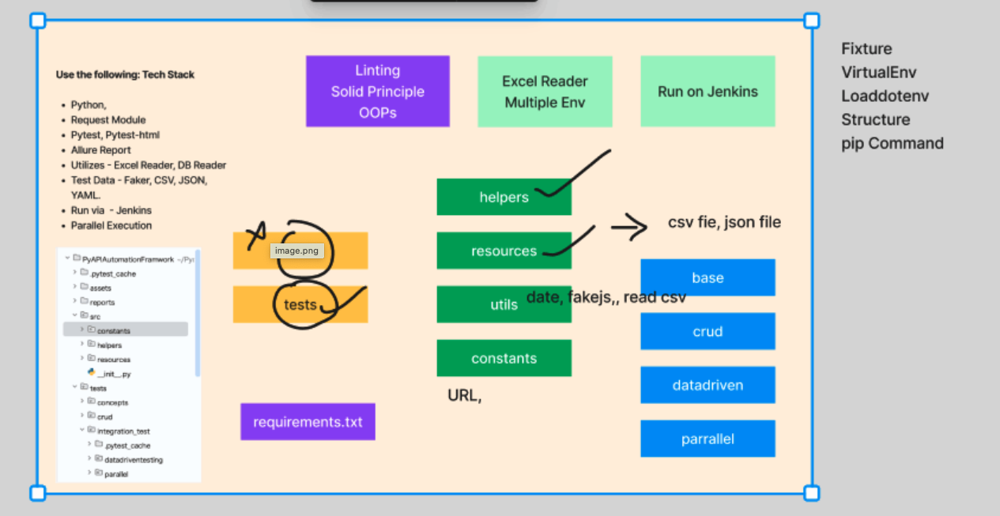

Python API Automation Framework
Hybrid Custom API Automation Framework include the proper folder structure.

Tech Stack

- Python 3.13
- Requests - HTTP Requests
- PyTest - Testing Framework
- Reporting - Allure Report, PyTest HTML
- Test Data - CSV, Excel
- Parallel Execution - x distribute (xdist)
- Advance API Testcase - jsonschema

How to Install Packages
    pip install requests pytest pytest-html faker allure-pytest jsonschema

How to run your Testcase Parallel pip install pytest-xdist 

How to run the Basic Test with Allure report

pytest tests/tests/crud/test_create_booking.py  --alluredir=allure_result -s